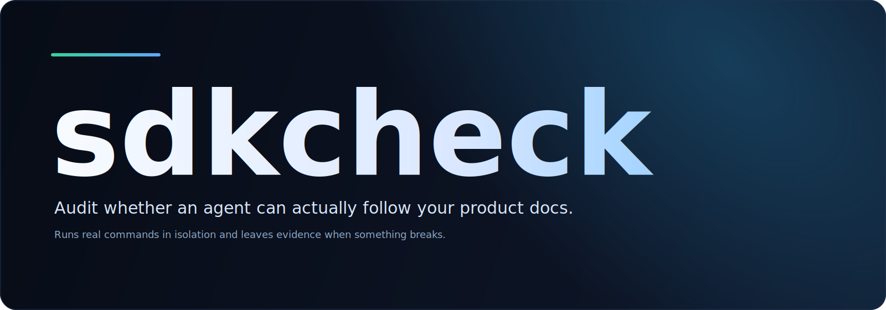

# sdkcheck

sdkcheck audits whether an agent can actually follow your product docs, install your product, and complete the intended usage flow.

It does not summarize docs. It executes them.

If something breaks, sdkcheck shows where it broke, which command failed, which env names were missing, and how to reproduce the result.

Docs are infrastructure for agents. Humans patch over outdated commands, missing environment variables, and unclear examples. Agents do not. sdkcheck treats docs as an execution contract and records what happens when that contract meets a real runtime.

In practice, sdkcheck:

- runs real commands such as `git clone`, package installation, CLI entry points, API calls, and output checks
- uses Docker by default so the result does not depend on a preconfigured laptop or shell
- writes Markdown and JSON reports with logs, missing env names, generated files, failure classification, and a reproduction command

## Product Shape

The public direction is intentionally narrow:

- one CLI
- one job: audit whether an agent can execute the documented product flow
- Docker-first execution
- explicit env pass-through
- evidence-first reporting

## Required Inputs

Each audit needs four things:

- a target repository
- doc files to seed the agent with, or a repo that has `README.md` / `docs/**/*.md`
- a plain-language goal plus optional success criteria
- an OpenAI-compatible model endpoint for sdkcheck's own audit agent

The audit agent uses:

- `SDKCHECK_AGENT_BASE_URL` or `--agent-base-url`
- `SDKCHECK_AGENT_MODEL` or `--agent-model`
- `SDKCHECK_AGENT_API_KEY` by default, or `--agent-api-key-env <ENV_NAME>`

## Quick Start

Point sdkcheck at a repository and tell the agent what must work:

```bash
cargo run --locked -- run \
  --repo https://github.com/acme/product.git \
  --docs README.md \
  --docs docs/quickstart.md \
  --goal "Install the product and complete the quickstart." \
  --success "The hello-world example exits with status 0." \
  --success "The documented output file is created." \
  --agent-base-url http://localhost:4000/v1 \
  --agent-model gpt-4.1-mini \
  --agent-api-key-env ANY_LLM_API_KEY \
  --env OPENAI_API_KEY \
  --env OPENAI_CHAT_MODEL_ID \
  --json-output reports/run.json
```

Use the local backend only for development:

```bash
sdkcheck run \
  --repo . \
  --goal "Install from source and run the example CLI." \
  --backend local \
  --agent-model gpt-4.1-mini
```

The audited runtime can receive any forwarded env names it needs. Common examples:

- `OPENAI_API_KEY` and `OPENAI_CHAT_MODEL_ID`
- `AZURE_OPENAI_API_KEY`, `AZURE_OPENAI_ENDPOINT`, `AZURE_OPENAI_CHAT_DEPLOYMENT_NAME`, and `AZURE_OPENAI_API_VERSION`

## What You Get

```text
wrote report: reports/run.md
wrote json report: reports/run.json
status: passed
classification: none
```

Each report includes the failing step, command evidence, missing env names, generated files, failure classification, and a reproduction command.

## Current MVP

- Rust CLI
- Docker-first execution
- local backend as an escape hatch
- generic repo/docs/goal audit input model
- one agent loop that can read files, run commands, and finish with a verdict
- Markdown and JSON reports
- env value masking
- command timeouts and log truncation

## Security

sdkcheck executes real commands and may touch real provider credentials.

- Docker is the default backend.
- Local execution requires explicit opt-in.
- Forwarded env values are passed by environment variable name.
- Forwarded env values are masked in captured output and reports.

Read [SECURITY.md](SECURITY.md) before running sdkcheck against untrusted repositories or production credentials.

## License

Apache-2.0. See [LICENSE](LICENSE).
